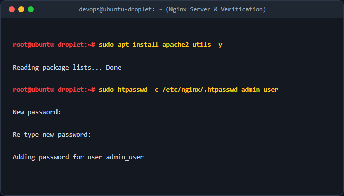
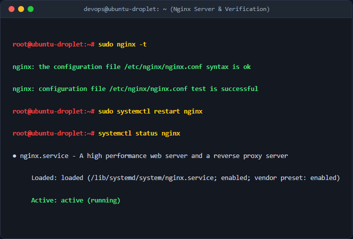
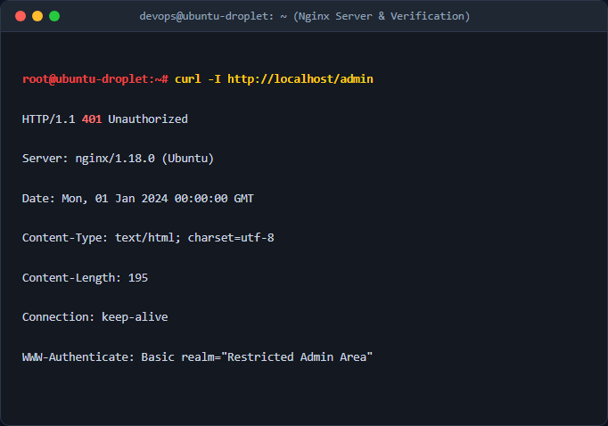
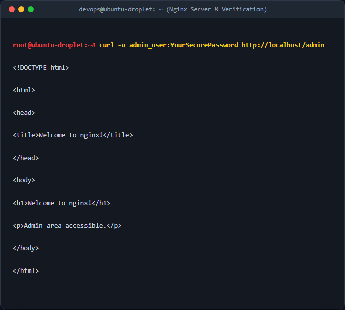

# Bảo mật tài nguyên bằng HTTP Basic Authentication trên Nginx

## 1. Mục tiêu & Bối cảnh kỹ thuật
- Bảo vệ đường dẫn nhạy cảm `/admin` trên Web Server Nginx bằng cơ chế xác thực HTTP Basic Authentication.
- Đảm bảo chỉ những người dùng có tài khoản hợp lệ mới có quyền truy cập vào khu vực quản trị nội bộ.
- Lưu trữ tệp mật khẩu băm tại `/etc/nginx/.htpasswd` để đảm bảo an toàn, tránh lộ thông tin qua mã nguồn tĩnh.

## 2. Các bước thực hiện chi tiết
- **Bước 1**: Cài đặt gói công cụ `apache2-utils` để sử dụng tiện ích sinh mật khẩu băm.
  ```bash
  sudo apt update && sudo apt install apache2-utils -y
  ```
- **Bước 2**: Tạo file mật khẩu ẩn `.htpasswd` và tài khoản quản trị `admin_user`.
  ```bash
  sudo htpasswd -c /etc/nginx/.htpasswd admin_user
  ```
  *(Hệ thống yêu cầu nhập mật khẩu bảo mật và xác nhận lại).*
- **Bước 3**: Cấu hình Nginx Server Block để tích hợp HTTP Basic Auth cho block location `/admin`.
  Chỉnh sửa file cấu hình Nginx (ví dụ: `/etc/nginx/sites-available/default` hoặc file riêng):
  ```nginx
  server {
      listen 80;
      server_name localhost;

      location /admin {
          auth_basic "Restricted Admin Area";
          auth_basic_user_file /etc/nginx/.htpasswd;
          try_files $uri $uri/ =404;
      }
  }
  ```
- **Bước 4**: Kiểm tra cú pháp Nginx và khởi động lại dịch vụ.
  ```bash
  sudo nginx -t
  sudo systemctl restart nginx
  ```


## 3. Kiểm tra & Xác thực kết quả
- **Test 1**: Gửi request thông thường không có thông tin xác thực:
  ```bash
  curl -I http://localhost/admin
  ```
  Kết quả mong đợi: HTTP/1.1 401 Unauthorized kèm tiêu đề `WWW-Authenticate`.

- **Test 2**: Gửi request kèm thông tin tài khoản hợp lệ:
  ```bash
  curl -u admin_user:YourSecurePassword http://localhost/admin
  ```
  Kết quả mong đợi: HTTP/1.1 200 OK (hoặc 404 Not Found nếu chưa có file index).


## 4. Kết luận & Best Practices bảo mật vận hành
- **Bảo mật tuyệt đối**: Không lưu trữ file `.htpasswd` trong thư mục gốc của web (`/var/www/html`) để tránh bị lộ qua HTTP.
- **Sử dụng HTTPS**: Luôn kích hoạt SSL/TLS (HTTPS) để mã hóa toàn bộ dữ liệu truyền tải, ngăn chặn việc kẻ xấu bắt gói tin (sniffing) lấy thông tin xác thực Basic Auth vì cơ chế này chỉ mã hóa base64 đơn giản.
- **Phân quyền chặt chẽ**: Đảm bảo phân quyền file `.htpasswd` chỉ cho phép user `root` hoặc `www-data` đọc để hạn chế rủi ro bảo mật.